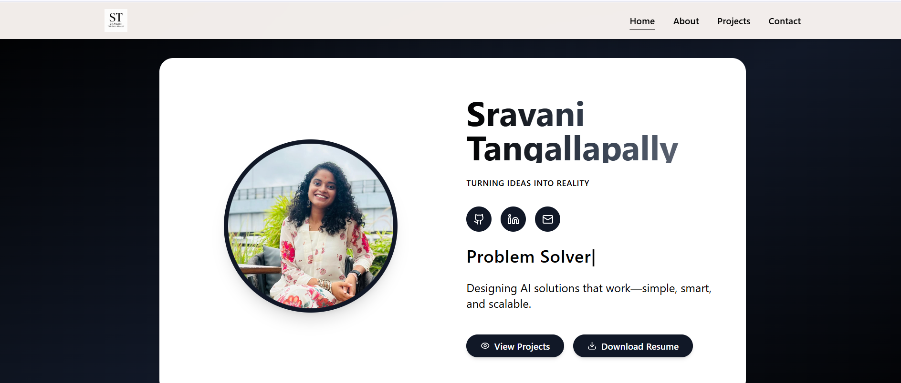
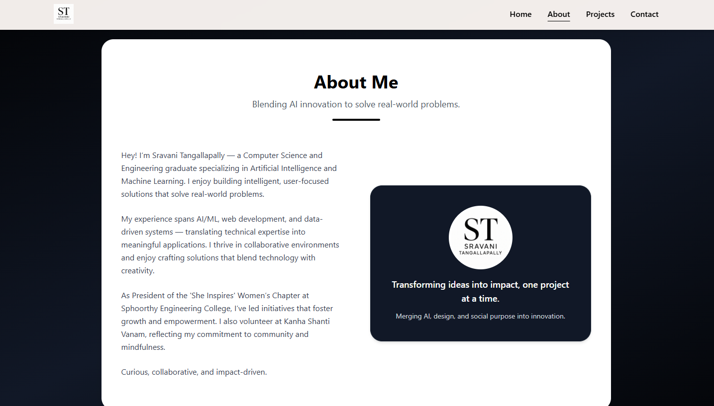
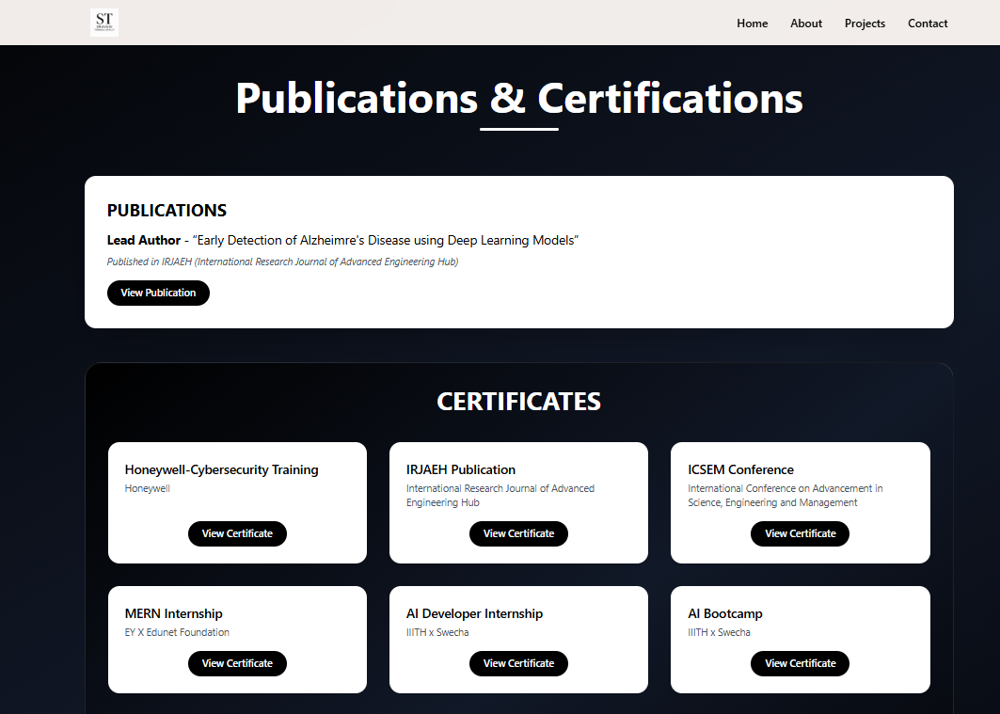
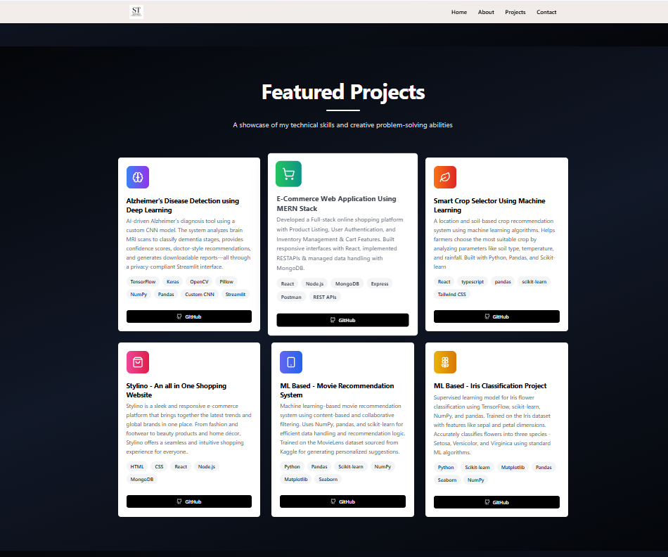
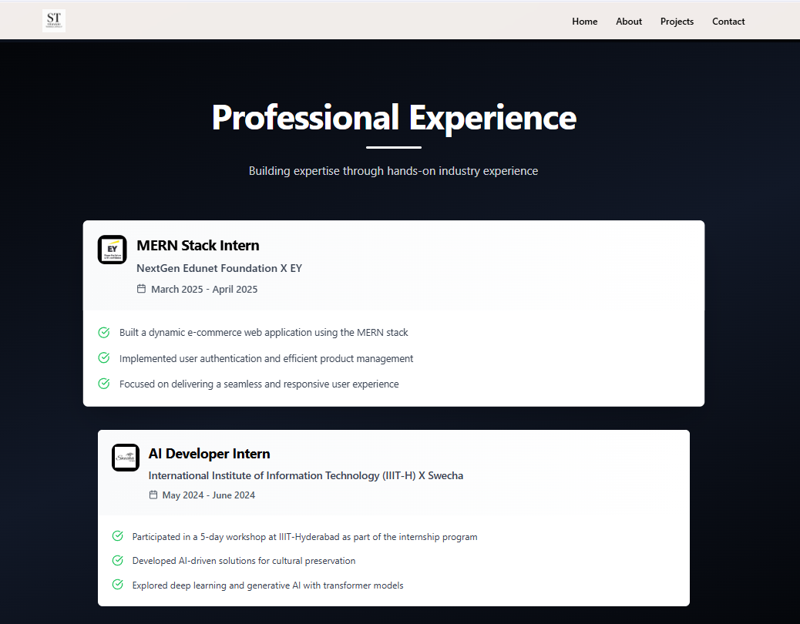
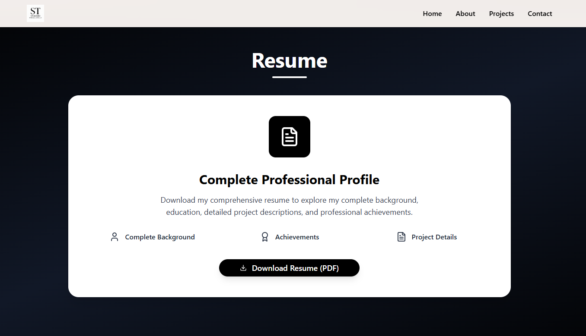

# Developer Portfolio Website

## Overview  
A modern, responsive personal portfolio built using React, Tailwind CSS, and Framer Motion. This portfolio showcases my projects, publications, skills, resume, and contact information - all in a clean, minimal layout. It includes animated transitions, theme toggling, and a contact form integrated with Formspree.

---

## Key Features  

- **Hero Section**: Professional intro with animated text and social links.
- **About Section**: Overview of who I am and what I do.
- **Projects Showcase**: Highlighting major projects with live links and GitHub repos.
- **Tech Stack**: Grid-based visual of my primary development tools and languages.
- **Experience & Resume**: Timeline of experience and a downloadable resume.
- **Publications & Certifications**: Interactive cards linking to official publications and credentials.
- **Contact Form**: Formspree-enabled contact form with name, email, and message fields.
- **Fully Responsive**: Looks great on all devices, from mobile to desktop.

---

## Technology Stack

| Category         | Tools/Technologies                        |
|------------------|-------------------------------------------|
| Frontend         | React.js, Tailwind CSS, Framer Motion     |
| Animations       | Framer Motion                             |
| Form Handling    | Formspree                                  |
| Icons            | Lucide React                              |
| Deployment       | GitHub, Vercel                            |

---

## Output Screenshots

### Homepage  


### About Page  


### Publications & Certifications  


### Projects  


### Tech Stack  


### Experience  


### Resume  


### Contact  


---

## How to Run the Project

### 1. Clone the Repository

```bash
git clone https://github.com/ASHRITH-SAMBARAJU/Portfolio.git
cd Portfolio
```

### 2. Install Dependencies

```bash
npm install
```

### 3. Start the Development Server

```bash
npm run dev
```

## Contact

**Sravani Tangallapally**  
Email: [ashrithsambaraju@gmail.com](mailto:ashrithsambaraju@gmail.com)  
LinkedIn: [linkedin.com/in/ashrith-sambaraju](https://www.linkedin.com/in/ashrith-sambaraju)  


